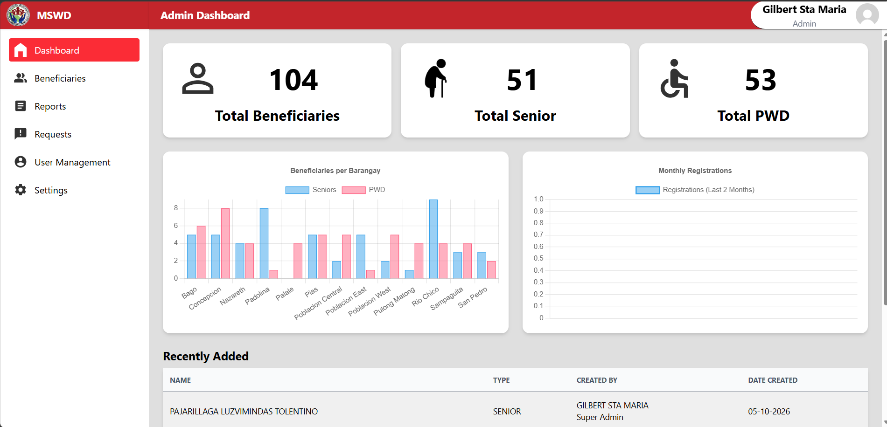
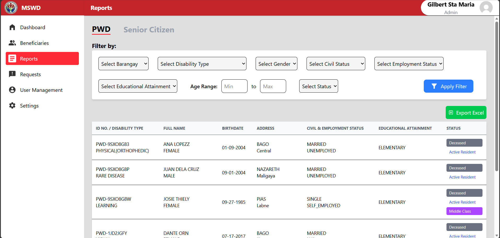
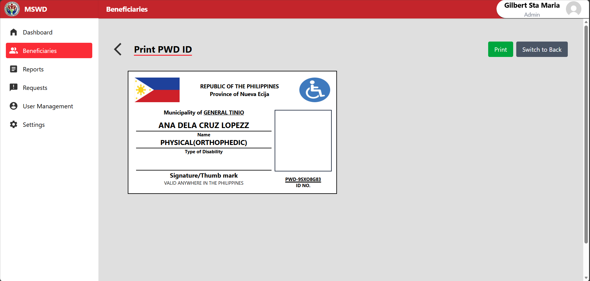
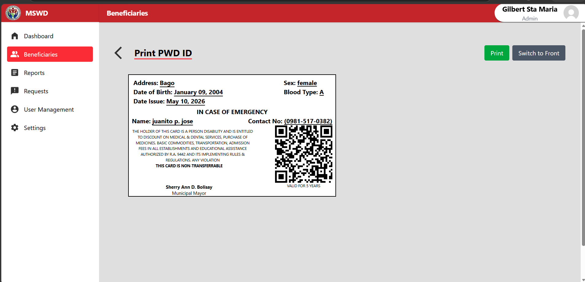
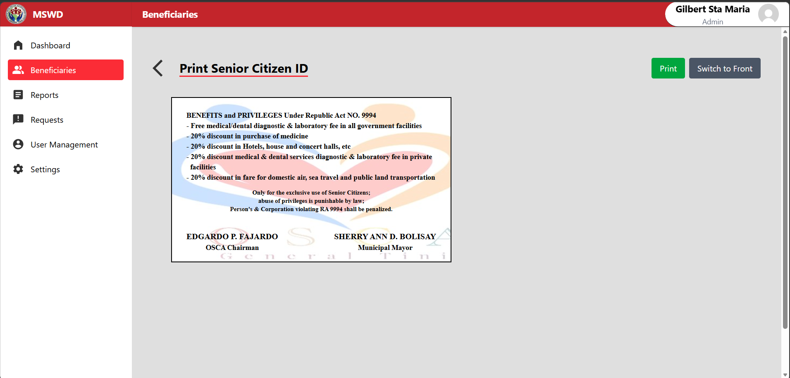
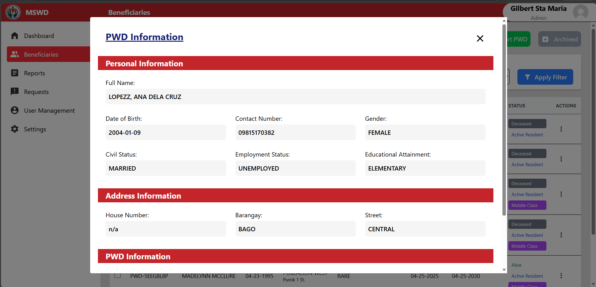

# Web-Based Centralized Senior Citizen and PWD Management System

A web-based management system designed to centralize and streamline the registration, management, monitoring, and reporting of Senior Citizen and Persons with Disabilities (PWD) records for the Municipal Social Welfare and Development Office (MSWDO).

---

## Overview

The Web-Based Centralized Senior Citizen and PWD Management System was developed to help the Municipal Social Welfare and Development Office manage Senior Citizen and PWD records in a centralized platform.

The system provides authorized personnel with tools for managing beneficiary records, organizing data by barangay, generating reports, managing identification records, and processing administrative requests.

The system was developed during my On-the-Job Training (OJT) at the Persons with Disability Affairs Office (PDAO) / Office for Senior Citizens Affairs (OSCA).

---

## Key Features

### Senior Citizen Management

- Register Senior Citizen records
- Update beneficiary information
- Search and filter records
- Manage Senior Citizen records by barangay
- Generate Senior Citizen reports
- Manage identification records

### PWD Management

- Register PWD records
- Update beneficiary information
- Search and filter records
- Manage PWD records by barangay
- Generate PWD reports
- Manage identification records

### Role-Based Access Control

The system provides different roles based on administrative responsibilities.

Roles include:

- Super Administrator
- PWD Administrator
- Senior Citizen Administrator
- Barangay PWD Administrator
- Barangay Senior Citizen Administrator

Each role is provided with access appropriate to its responsibilities.

### Reports

The system provides centralized reporting capabilities for administrative use.

Reports can be generated based on available beneficiary information and administrative criteria.

### Excel Export

The system supports exporting records and reports to Excel format for administrative and reporting purposes.

### Identification Management

The system provides functionality for managing beneficiary identification records.

Features include:

- ID record management
- QR code generation
- Identification information
- Signatory management

---

## Screenshots

### Student










## Tech Stack

### Backend

- Laravel
- PHP
- MySQL

### Frontend

- Laravel Blade
- Tailwind CSS
- JavaScript

---

## Installation

### 1. Clone the repository

```bash
git clone https://github.com/gilbeee-web/senior-pwd-system.git
cd senior-pwd-system
```

### 2. Install PHP dependencies

```bash
composer install
```

### 3. Install JavaScript dependencies

```bash
npm install
```

### 4. Configure environment

Create a `.env` file from the example:

```bash
cp .env.example .env
```

Then configure your database connection in the `.env` file.

### 5. Generate application key

```bash
php artisan key:generate
```

### 6. Run database migrations

```bash
php artisan migrate
```

### 7. Run database seeders

If seeders are available:

```bash
php artisan db:seed
```

### 8. Start the development server

```bash
php artisan serve
```

For frontend asset development, run this in a separate terminal:

```bash
npm run dev
```

---

## Author

**Gilbert Sta. Maria**
Junior Full-Stack Web Developer

- Portfolio: [my-portfolio-rust-nu-38.vercel.app](https://my-portfolio-rust-nu-38.vercel.app/)
- GitHub: [github.com/gilbee-web](https://github.com/gilbee-web)